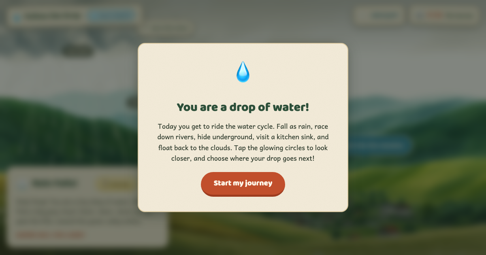

<p align="center">
  <a href="https://maninae.github.io/follow-the-drop/">
    
  </a>
</p>

<h1 align="center">💧 Follow the Drop</h1>

<p align="center"><em>You are a drop of water. Where do you go next?</em></p>

<p align="center">
  <a href="https://maninae.github.io/follow-the-drop/"><strong>▶ Play it in your browser</strong></a>
</p>

---

A choose-your-own-path adventure through the water cycle, made for
first graders (and anyone curious how a raindrop ends up in a glacier,
a beaver dam, or a kitchen sink). You start as a raindrop falling from
a cloud. Every page asks the question kids actually ask: *where does
the water go next?*

Sink into the soil or ride the stream? Melt into a river or drift to
the sea as an iceberg? Take a wrong turn down the kitchen drain and
find out how the water gets clean and comes back.

## What kids do

- **Choose a path at every scene** — trail signs sit right on the thing
  they name. Tap the soil to soak in, tap the stream to race downhill.
- **Discover real facts** — glowing circles hide one-line facts ("a
  raindrop falls about as fast as you ride a bike"), and every scene
  has a golden *"Long ago…"* story (the water you drink really did
  rain on dinosaurs).
- **Earn stamps and badges** — an Explorer's Journal fills in a fog-of-war
  map as you wander, hands out badges for journeys like *Shape Shifter*
  and *Round and Round*, and ticks an odometer counting the years your
  drop has been traveling.
- **Read it themselves or hear it read** — short, first-grade sentences,
  with a 🔊 read-aloud button on every page for pre-readers.
- **Wander without dead ends** — the water cycle is a loop, so the
  journey just keeps going. A 🌬️ wind-gust button shuffles the drop
  somewhere new when no one can decide.

## What kids learn

Twenty illustrated scenes cover the **nature cycle** (cloud → rain or
snow → land → river → lake or ocean → evaporation → cloud) and the
**human water cycle** that borrows water from a river, cleans it at a
treatment plant, sends it to the kitchen tap, and returns it through
the sewer. Side adventures: a thunderstorm, a beaver dam, a crystal
cave, a geyser, and a trip *inside a kid who drinks you*.

> The full scene map is in [`docs/scene-graph.png`](docs/scene-graph.png).

## Best for

Ages 6–8 (roughly first grade). Works on phones, tablets, and
computers. No login, no ads, no tracking.

## How it's built

Plain static site — HTML, CSS, vanilla JS, no build step and no
dependencies. The scene art is AI-painted gouache (FLUX) over an
earlier handcrafted SVG fallback set. Architecture notes for anyone
poking around the code are in [`CLAUDE.md`](CLAUDE.md).

Run it locally:

```
python3 -m http.server -d . 8000
```

then open <http://localhost:8000>.

## License

[MIT](LICENSE) — share it with classrooms, remix it, repaint the
scenes. If you build something with it, I'd love to see.
