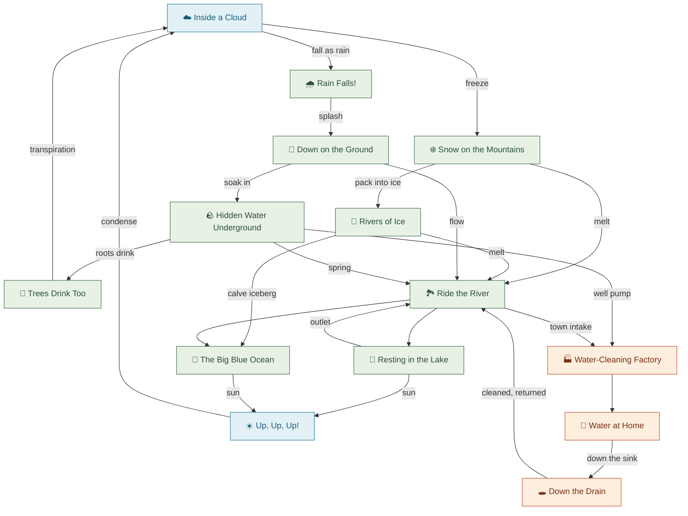

# 💧 Follow the Drop

**Be a drop of water.** A choose-your-own-adventure journey through the
water cycle, made for young explorers (ages 5–8).

**Play it:** https://maninae.github.io/follow-the-drop/

You start as a raindrop falling from a cloud. From there, every page asks
the question kids actually ask: *where does the water go next?* Sink into
the soil or ride the stream? Melt into a river or drift to the sea as an
iceberg? Follow your drop down the kitchen drain and find out how it gets
clean and comes back.

## What's inside

- **14 illustrated scenes** in a national-park-sign storybook style —
  clouds, glaciers, meadows, aquifers, rivers, the ocean, and the human
  side too: the treatment plant, the kitchen tap, the pipes under the street
- **A directed graph, not a list** — go forward ("where does it go?") or
  backward ("where did it come from?"); the cycle never ends, just like
  the real one
- **Tap-to-discover hotspots** — glowing circles hide real facts about
  herons, aquifers, snowflakes, and water towers
- **A Water Passport** — collect a stamp for every place your drop visits
- **Read-aloud button** on every page for pre-readers
- Watery blur transitions between scenes

## The map

Fourteen scenes in one connected cycle — the nature loop, plus the human
water loop that borrows from the river and gives it back
(forward edges shown; most are also walkable backward in-game):



(Rendered copy: `docs/scene-graph.png`.)

## Running locally

It's a plain static site — no build, no dependencies:

```
python3 -m http.server -d . 8000
```

then open http://localhost:8000.

## Project notes

The scene graph and all copy live in `js/data.js`. Architecture details
are in `CLAUDE.md`. The SVG scene art can optionally be repainted as
AI-generated gouache illustrations with `build/regenerate-images.py`.
